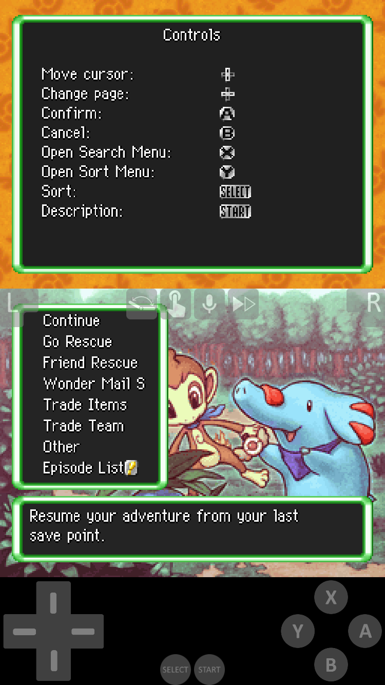

# Emulation

## iOS
Available for iOS is Delta! You can find it here: 
<https://apps.apple.com/us/app/delta-game-emulator/id1048524688>

Really easy, you open up the app, add a file from the top right + icon.

  
   

Nice huh? You can even download some more skins for the player :3

<https://delta-skins.github.io/nds.html>

## Android
For android we will use melonDS!
<https://play.google.com/store/apps/details?id=me.magnum.melonds>

Similarly, you'll go into settings and find a folder to load ROMs from.

  

I don't think you can change the skin of the melonDS control layout, there may be other emulators out there that are more customizable but any I found on the app store had ads or were paid or something.

If you experience any problems let me know I'll help you figure it out!
