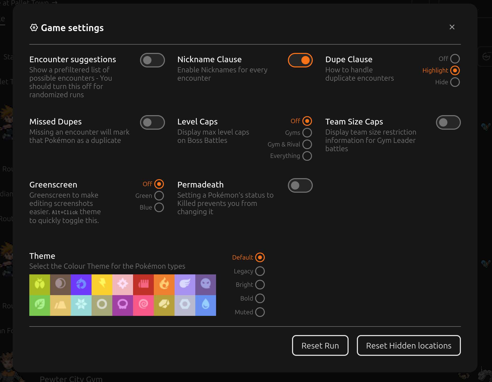
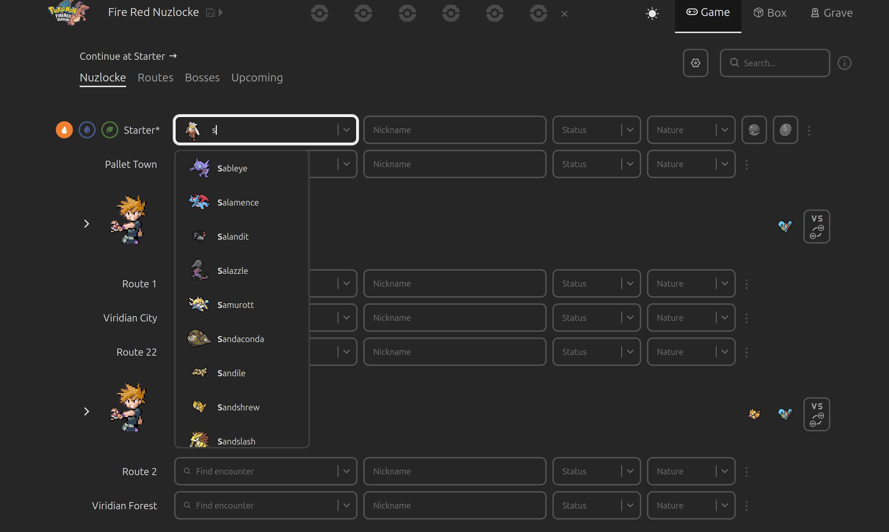
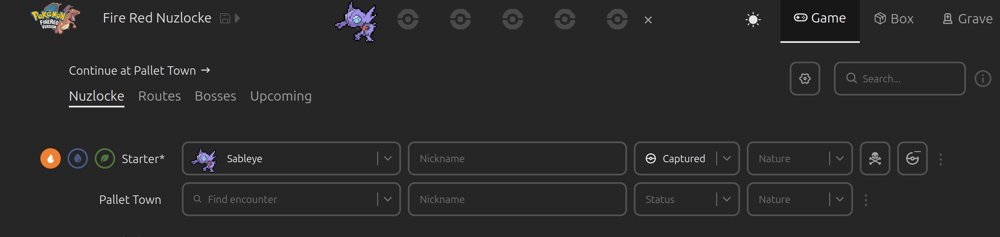
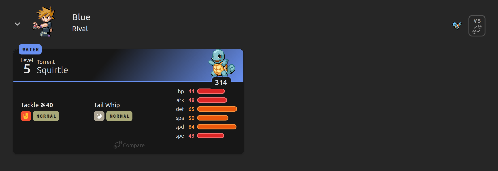
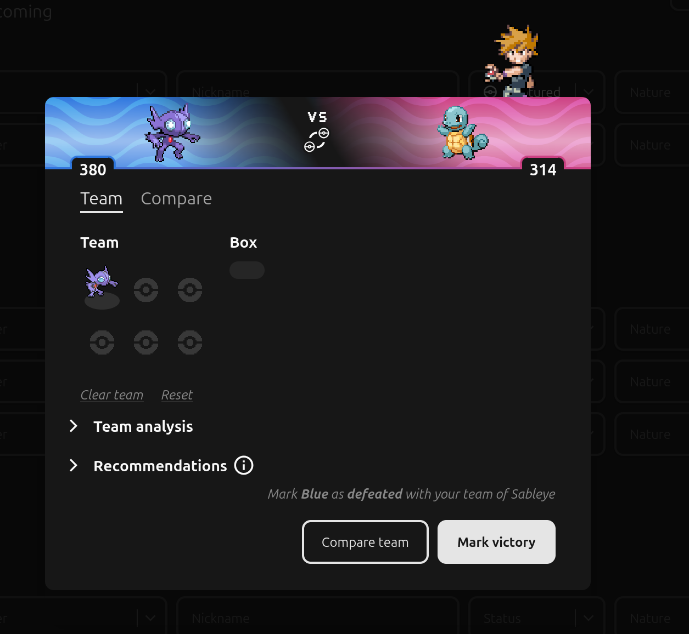
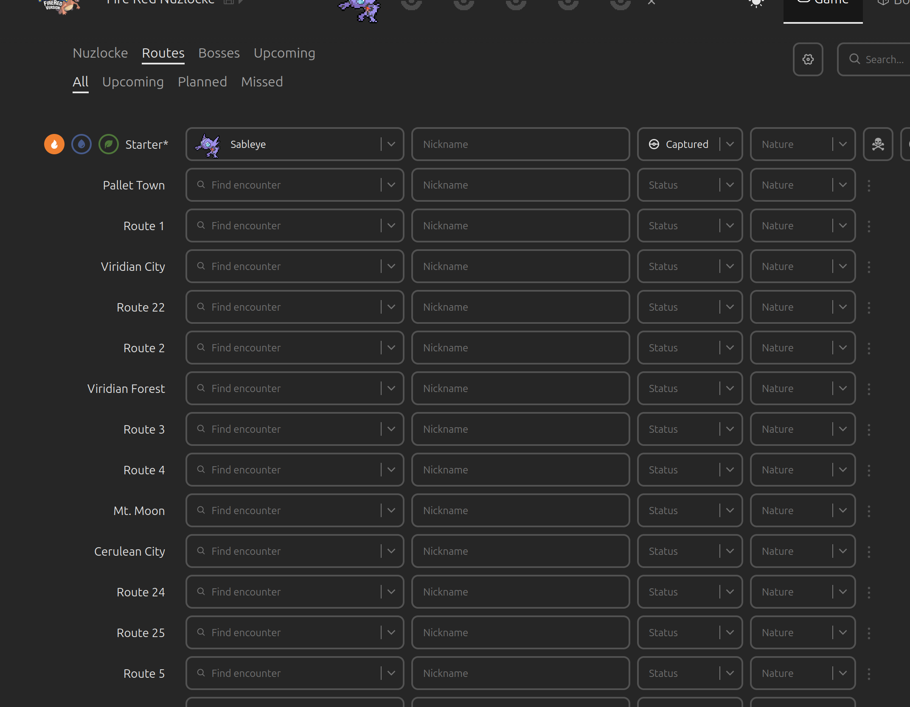

# Nuzlocke Tracking

It is suggested that you keep track of your adventure, for our later sharing!
Things you probably wanna remember:
- what pokemon was caught and where
- tough battle results
- crazy pokemon you saw

I suggest this site [nuzlockeredux.com](https://nuzlockeredux.com/) for tracking! 

For settings, you can turn off "encounter suggestions" and "level caps." mess with the other settings if you want.

If you type in a pokemon it will list them :)

When you mark a pokemon as captured, it will give you the option to add it to your team. 

I don't think we can change the listed "boss" pokemon, but we can mark them as defeated.
To mark them as defeated you can click the little VS icon (on the right)

And then at the bottom mark your victory!

most usefully, this site has a place where you can pick each pokemon you've caught on each route. seems useful to keep track of.

theres some other stuff available but of course this is all optional!!!!!!!
